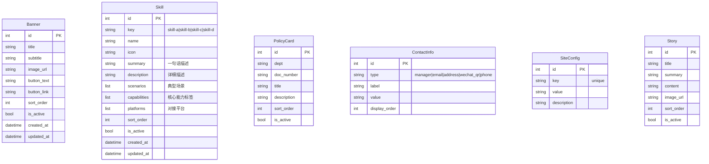
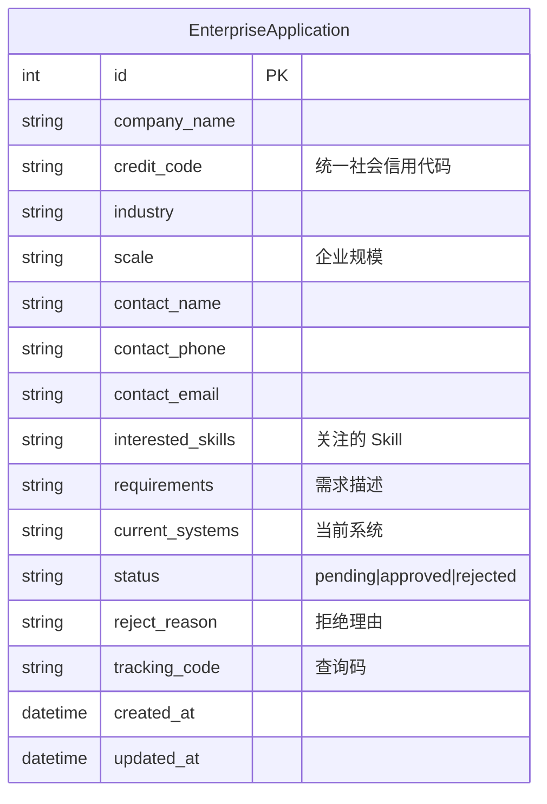
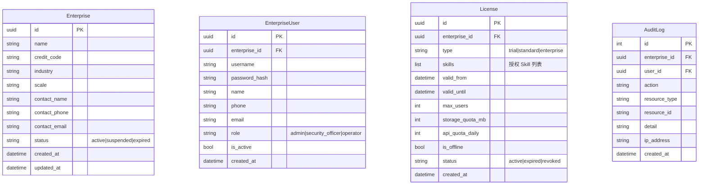

# 架构设计 — 南京流苏 AI 智能体平台

> **版本**: v0.1 (草案)
> **日期**: 2026-04-30
> **状态**: 🟡 草稿

---

## 1. 整体架构图

```
┌──────────────────────────────────────────────────────────────────────────────┐
│                              Presentation Layer                              │
│  ┌──────────────────┐  ┌──────────────────┐  ┌──────────────────────────┐   │
│  │ www (官网)        │  │ admin (SaaS管理)  │  │ enterprise (企业端)      │   │
│  │ React + AntD     │  │ React + AntD     │  │ React + AntD            │   │
│  └────────┬─────────┘  └────────┬─────────┘  └───────────┬──────────────┘   │
│           │                     │                        │                  │
├───────────┼─────────────────────┼────────────────────────┼──────────────────┤
│           │                     │                        │                  │
│           ▼                     ▼                        ▼                  │
│  ┌──────────────────────────────────────────────────────────────────────┐   │
│  │                        API Gateway (Nginx)                           │   │
│  │  /api/cms/*  → 官网    /api/admin/*  → SaaS    /api/enterprise/* → 企  │   │
│  └──────────────────────────────────────────────────────────────────────┘   │
│                                    │                                        │
│  ┌─────────────────────────────────┼──────────────────────────────────────┐ │
│  │                                 ▼                                      │ │
│  │                   FastAPI Application                                  │ │
│  │                                                                        │ │
│  │  ┌────────────┐  ┌────────────┐  ┌────────────┐  ┌────────────┐      │ │
│  │  │ CMS Router │  │ Apply      │  │ Admin      │  │ Enterprise │      │ │
│  │  │ (公开)     │  │ Router     │  │ Router     │  │ Router     │      │ │
│  │  └─────┬──────┘  │ (公开)     │  │ (super_    │  │ (tenant)   │      │ │
│  │        │         └─────┬──────┘  │  admin)    │  └──────┬──────┘      │ │
│  │        │               │         └─────┬──────┘         │             │ │
│  │        ▼               ▼               ▼                ▼             │ │
│  │  ┌─────────────────────────────────────────────────────────────────┐  │ │
│  │  │                        Service Layer                             │  │
│  │  │  CMS Service  │  Apply Service  │  Enterprise Service  │  ...   │  │
│  │  └─────────────────────────────────────────────────────────────────┘  │ │
│  │                                    │                                   │ │
│  │  ┌─────────────────────────────────┼─────────────────────────────────┐ │ │
│  │  │                                 ▼                                 │ │
│  │  │                    AI 能力层 (Skill Engine)                        │ │
│  │  │  ┌──────────┐ ┌──────────┐ ┌──────────┐ ┌──────────┐           │ │
│  │  │  │ Skill-A  │ │ Skill-B  │ │ Skill-C  │ │ Skill-D  │  ...      │ │
│  │  │  │ 资产管家  │ │ 合规哨兵  │ │ 监控哨兵  │ │ 管控中台  │           │ │
│  │  │  └──────────┘ └──────────┘ └──────────┘ └──────────┘           │ │
│  │  └─────────────────────────────────────────────────────────────────┘ │
│  │                                    │                                   │
│  └────────────────────────────────────┼───────────────────────────────────┘
│                                       │
├───────────────────────────────────────┼───────────────────────────────────┤
│                                       ▼                                   │
│  ┌──────────────────────────────────────────────────────────────────────┐  │
│  │                         Data Layer                                    │  │
│  │  ┌──────────┐ ┌──────────┐ ┌──────────┐ ┌──────────┐ ┌──────────┐  │  │
│  │  │PostgreSQL│ │  Redis   │ │  MinIO   │ │  Milvus  │ │ TDengine │  │  │
│  │  │(业务数据) │ │  (缓存)  │ │(文件存储) │ │(向量库)  │ │(时序数据) │  │  │
│  │  └──────────┘ └──────────┘ └──────────┘ └──────────┘ └──────────┘  │  │
│  └──────────────────────────────────────────────────────────────────────┘  │
└──────────────────────────────────────────────────────────────────────────────┘
```

---

## 2. 数据模型概览

### 2.1 官网 CMS



### 2.2 入驻申请



### 2.3 SaaS 平台 (Phase 2)



---

## 3. API 契约总览

### 3.1 公开 API

| 方法 | 路径 | 认证 | 说明 |
|------|------|------|------|
| GET | `/api/cms/banners` | 无 | Banner 列表 |
| GET | `/api/cms/skills` | 无 | Skill 列表 |
| GET | `/api/cms/skills/{key}` | 无 | Skill 详情 |
| GET | `/api/cms/policies` | 无 | 政策合规列表 |
| GET | `/api/cms/contact` | 无 | 联系方式 |
| GET | `/api/cms/config/{key}` | 无 | 站点配置 |
| GET | `/api/cms/stats` | 无 | 统计数据 |
| GET | `/api/cms/stories` | 无 | 案例列表 |
| POST | `/api/apply` | 无 | 提交入驻申请 |
| GET | `/api/apply/status` | 无 | 查询进度 |

### 3.2 管理 API (super_admin)

| 方法 | 路径 | 说明 |
|------|------|------|
| POST | `/api/admin/login` | 登录 |
| GET | `/api/admin/applications` | 申请列表 |
| PUT | `/api/admin/applications/{id}` | 审核申请 |
| GET | `/api/admin/stats` | 平台统计 |
| GET/POST/PUT/DELETE | `/api/cms/admin/*` | CMS 内容 CRUD |

### 3.3 企业端 API (tenant)

| 方法 | 路径 | 说明 |
|------|------|------|
| POST | `/api/enterprise/auth/login` | 企业用户登录 |
| GET | `/api/enterprise/dashboard` | 工作台数据 |
| GET | `/api/enterprise/skills` | 已开通 Skill 列表 |
| GET | `/api/enterprise/users` | 成员列表 |
| POST | `/api/enterprise/users` | 新增成员 |
| ... | (Phase 2 详细定义) | |

---

## 4. 安全设计

### 4.1 认证体系

```
官网: 无认证 (公开)
  └─ CMS 管理后台: JWT (super_admin)

SaaS 管理后台: JWT (super_admin)

企业端: JWT (enterprise_user)
  └─ JWT payload: { user_id, tenant_id, role, enterprise_id }
  └─ 所有 API 通过 get_current_enterprise_user 中间件
```

### 4.2 密码安全

- 使用 bcrypt 哈希 (参考 ai-admin-demo)
- 初始密码为随机生成的强密码，首次登录强制修改
- 密码强度要求：≥8 位，含大小写字母 + 数字

### 4.3 API 安全

- 所有管理 API 受 JWT 保护
- 企业端 API 受 `tenant_id` 行级隔离 + JWT 双重保护
- 敏感操作记录审计日志
- 限制登录失败次数 (5 次后锁定 15 分钟)

---

## 5. 部署架构

### 5.1 SaaS 部署 (腾讯云)

```
                 ┌──────────────┐
                 │   TencentOS  │
                 │   Server 3.3 │
                 └──────┬───────┘
                        │
              ┌─────────┴─────────┐
              │     Nginx         │
              │  SSL Termination  │
              │  www.sty.org.cn   │
              └─────────┬─────────┘
                        │
              ┌─────────┴─────────┐
              │   Docker Compose   │
              │                   │
              │  FastAPI (backend) │
              │  Vite (frontend)   │
              │  PostgreSQL        │
              │  MinIO             │
              │  Redis             │
              └───────────────────┘
```

### 5.2 开发环境

```
WSL2 (Ubuntu)
  └─ /home/fu/projects/nanjingliusu/
     ├── backend/        # FastAPI + SQLite (开发)
     ├── frontend/       # Vite dev server
     └── docker-compose  # 可选 (需数据库时)
```
